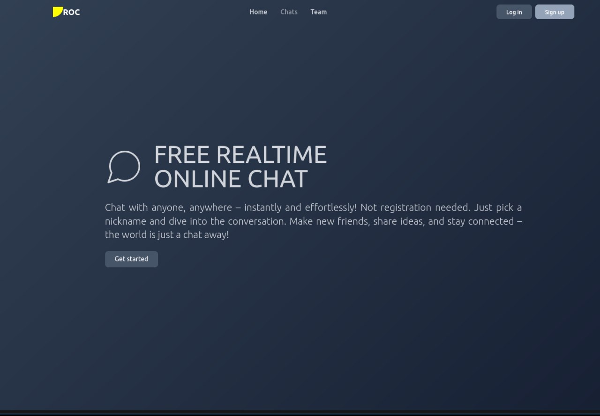
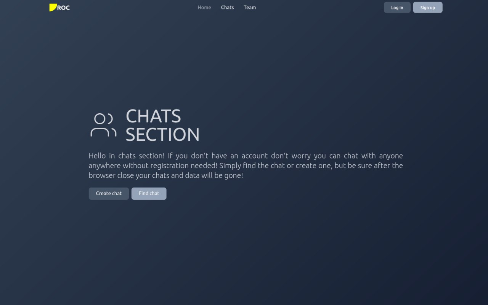
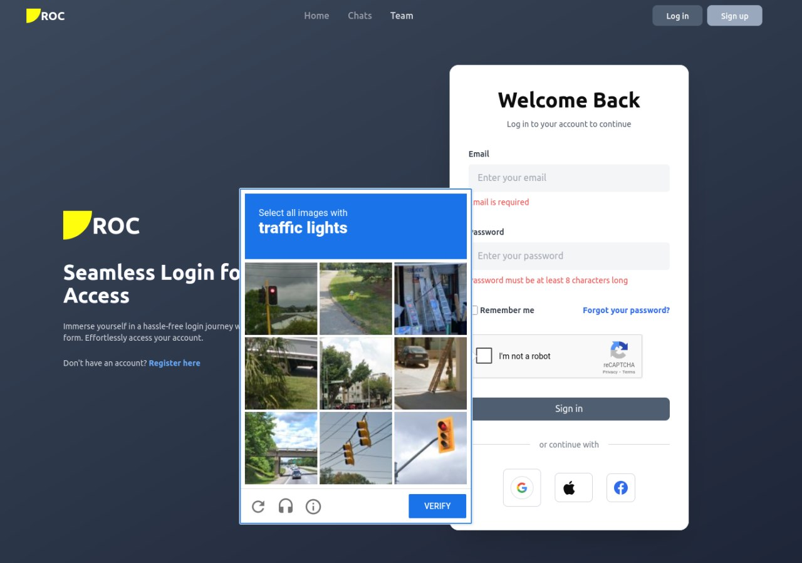
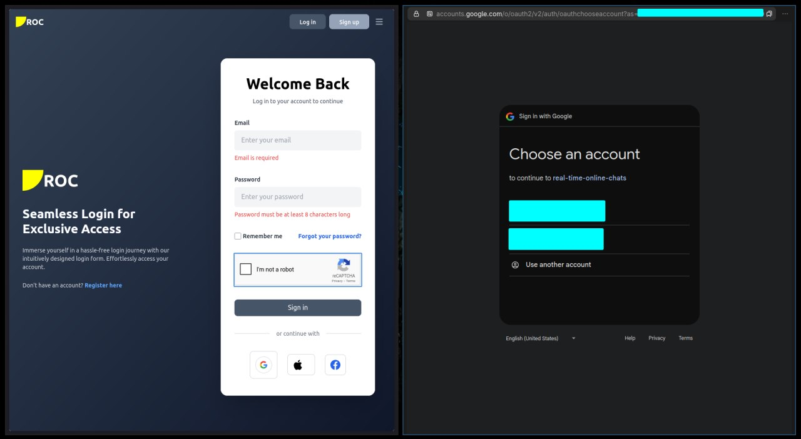
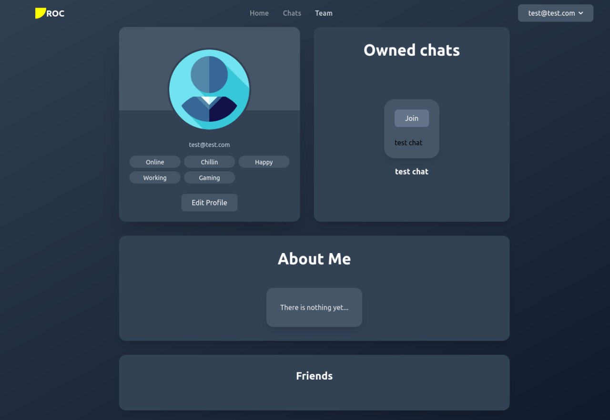
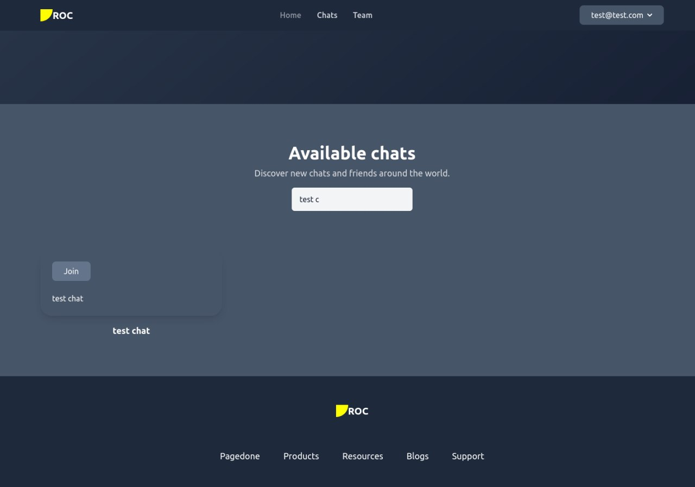
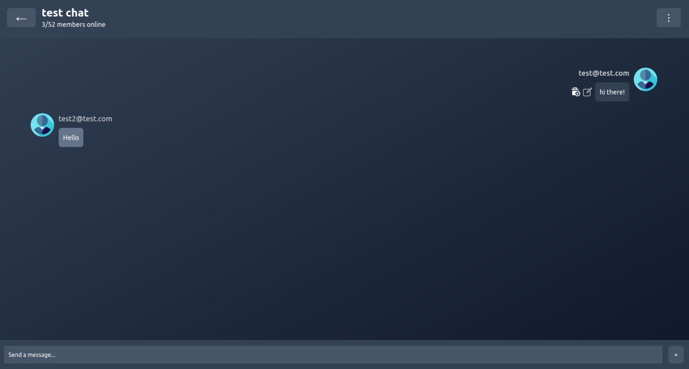
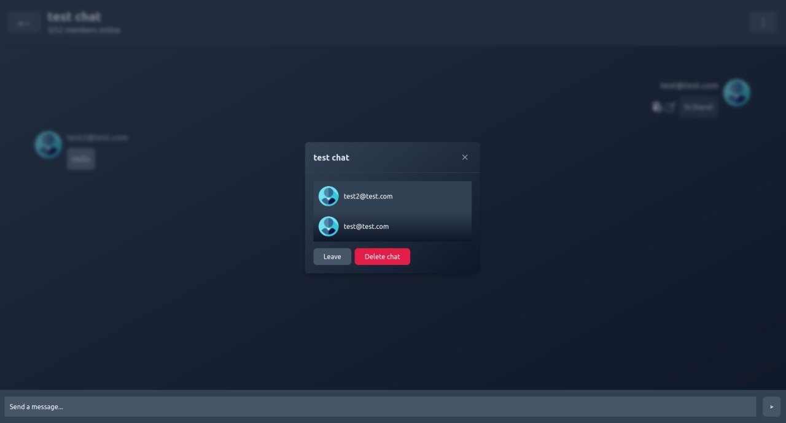
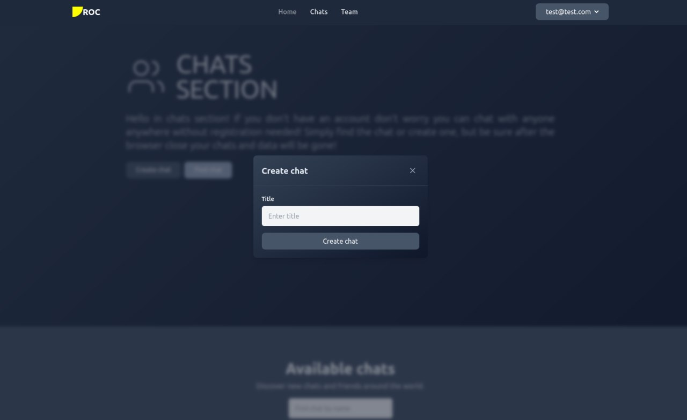

# real-time-online-chats

**real-time-online-chats** is a simple website developed using C# ASP.NET Core (WebAPI) and React that allows users to chat in real time.

## Features

- **Messaging**: Users can send messages in chat in real time. 
- **Member chat interaction**: Users can create, edit and delete their messages in chat in real time, join/leave chat, see the chat info.
- **Owner chat interaction**: Owner of the chat can kick member, grant member to owner privilege (after that owner will become a member) and delete chat. 
- **User profiles**: Customize your profile with personalized information.
- **Authentication**: Users can login and signup manually with password or via Google Auth.
- **Email confirmation**: After user signup he must confirm his email sended on specified email.
- **Antibot**: Before user signup or login he must pass Google reCAPTHCA.
- **Reset password**: Also known as "Forgot password?". User can request password reset via specified email.
  - https://dotnettutorials.net/lesson/forgot-password-in-asp-net-core-identity/
- **Search functionality**: Search chats by title.

## Behind the scene

- **Caching**: Caching is made in several endpoints via Redis.
  - https://stackexchange.github.io/StackExchange.Redis/
- **Google Auth**: Google auth integration in this project to perform fast and easy login.
  - https://learn.microsoft.com/en-us/aspnet/core/security/authentication/social/google-logins?view=aspnetcore-9.0
- **reCAPTCHA**: Google reCAPTCHA helps prevent bots from interacting with website.
  - https://www.google.com/recaptcha/admin/create
  - https://developers.google.com/recaptcha/docs/display
- **Authorization**: Authorization to account is made via JWT + Refresh token to reduce token guessing.
- **Images storage**: Instead of using database for storing images (known as blob type in databases) I used Cloudinary service.
  - https://cloudinary.com/
  - https://cloudinary.com/documentation/dotnet_integration
- **Real time communication**: I used Microsoft SignalR library which simplifies the process of adding real-time web functionality to applications.
  - https://learn.microsoft.com/en-us/aspnet/signalr/overview/getting-started/introduction-to-signalr
  - https://learn.microsoft.com/en-us/aspnet/core/tutorials/signalr?view=aspnetcore-9.0&WT.mc_id=dotnet-35129-website&tabs=visual-studio
- **Db stuff**: I used EF Core with Postgres SQL.
- **Make environment**: You can run application with ```make start``` (Unix only since I use custom ```.sh``` bash scripts which is not supported on Windows). Also you need to make sure that ```Make``` and ```Docker``` are installed.
- **Docker environment**: You can run application with ```docker-compose up --build```. Also you need to make sure ```Docker``` is installed.

## Screenshots

### Home page



### Chats section page



### Google reCAPTHCA example



### Google Auth example



### User profile



### Chats filter



### Chats communication



### Chat header



### Create form modal popup



**Note**: There are more pages, but these are the main ones.

## Getting Started
### Prerequisites

To get started, ensure you have the following installed:

- .NET Core Runtime
- ASP.NET Core Runtime
- node.js, npm, vite
- Docker
- Make
- bash
- Git

## Clone the repository:

```
git clone https://github.com/Quikler/real-time-online-chats.git
```

## Setup Instructions

### 1. Navigate to the project directory:
```
cd real-time-online-chats
```

### 2. Install .NET dependencies:
Restore the necessary packages by running:
```
dotnet restore real-time-online-chats.Api
```

### 3. Test .NET project (Docker is required):
```
dotnet test real-time-online-chats.Api
```

### 3. Install React dependencies (vite is required):
```
cd real-time-online-chats.Client && npm i
```

### 4. Run project via Make (Make and Docker are required on Unix):
```
make start
```
### OR

### 4. Run project via Docker (Docker is required):
```
docker-compose up --build
```

## Support

If you have any questions or encounter any issues, feel free to <a href="https://github.com/Quikler/real-time-online-chats/issues">open an issue</a> or contact me directly.

## Libraries and Frameworks

### Backend:
- ASP.NET Core Identity
- Entity Framework Core
- Postgre SQL
- SignalR
- StackExchangeRedis
- Google.Apis.Auth
- CloudinaryDotNet
- FluentValidation
- JWT Auth

### Frontend:
- Vite + React + TS
- TailwindCSS
- React Context
- reCAPTHCA
- Google Auth

## License

This project is licensed under the MIT License. See the [LICENSE](https://github.com/Quikler/real-time-online-chats/blob/master/LICENSE) file for more details.

### Developed with ❤️ by Quikler
